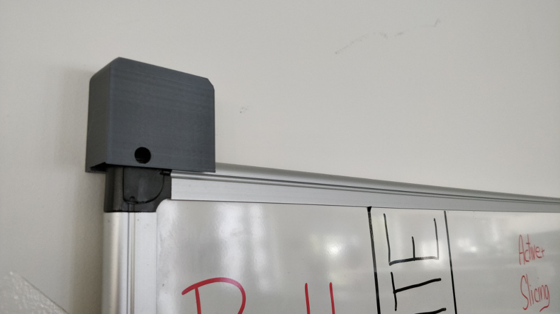
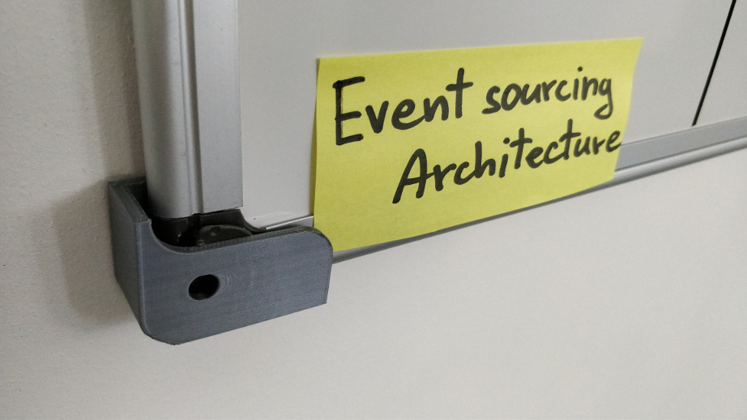

Board mount which helps with removal and mounting back of a board.

It's handful when you need to take scrum board to a meeting with weekly review.

The design was made by [Aleš Koblížek](https://github.com/donutti).

OnShape link: https://cad.onshape.com/documents/0b9a6f8e742e165b05e970f7/w/1ff316bbbef1d326d362ca53/e/1a37b3b657dfa64617247f25
